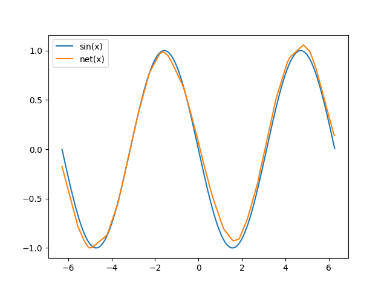

# Meta Learning in PyTorch
*Nov 7, 2018*

Got an image recognition problem? A pre-trained ResNet is
probably a good starting point. Transfer learning, where
the weights of a pre-trained network are fine tuned for the
task at hand, is widely used because it can drastically reduce
both the amount of data to be collected and the total time
spent training the network. But ResNet wasn't trained
with the intention of being a good starting point for transfer
learning. It just so happens that it works well. But what if a
network is trained specifically to obtain weights that are good
for generalizing to a new task? That's what meta learning aims to do.

The usual setting in meta learning involves a distribution of tasks.
During training, a large number of tasks, but with only a few
labeled examples per task, are available. At "test time", a new,
previously unseen, task is provided with a few examples. Using only
these few examples, the network must learn to generalize to new
examples of the same task. In meta learning, this is accomplished
by running a few steps of gradient descent on the examples of the new
task provided during test. So, the goal of the training process
is to discover similarities between tasks and find network weights that
serve as a good starting point for gradient descent at test time on a
new task.

## Model Agnostic Meta Learning (MAML)
[MAML](https://arxiv.org/abs/1703.03400) differentiates through the
stochastic gradient descent (SGD) update steps and learns weights that
are a good starting point for SGD at test time. i.e.., gradient descent-ception.
This is what the training loop looks like:

```
- randomly initialize network weights W
for it in range(num_iterations):
    - Sample a task from the training set
    - Compute loss L using current weights W
    - Wn = W - inner_lr * dL/dW
    - Compute loss Ln using tuned weights Wn
    - Update W = W - outer_lr * dLn/dW
```

To compute the loss `Ln`, the tuned weights `Wn` are used.
But, we need to find gradients with respect to the original
weights `dLn/dW`. Computing this involves finding higher-order
derivatives of the loss with respect to the original weights `W`.

At test time:

```
- Given trained weights W and a few examples of a new task
- Compute loss L using weights W
- Wn = W - inner_lr * dL/dW
- Use Wn to make predictions for that task
```

Let's try learning to generate a sine wave from only 4 data points.
To keep it simple, let's fix the amplitude and frequency but randomly
select the phase between 0 and 180 degrees. At test time, the model
must figure out what the phase is and generate the sine wave from
only 4 example data points.

```
import math
import random
import torch # v0.4.1
from torch import nn
from torch.nn import functional as F
import matplotlib as mpl
mpl.use('Agg')
import matplotlib.pyplot as plt

def net(x, params):
    x = F.linear(x, params[0], params[1])
    x = F.relu(x)

    x = F.linear(x, params[2], params[3])
    x = F.relu(x)

    x = F.linear(x, params[4], params[5])
    return x

params = [
    torch.Tensor(32, 1).uniform_(-1., 1.).requires_grad_(),
    torch.Tensor(32).zero_().requires_grad_(),
    
    torch.Tensor(32, 32).uniform_(-1./math.sqrt(32), 1./math.sqrt(32)).requires_grad_(),
    torch.Tensor(32).zero_().requires_grad_(),
    
    torch.Tensor(1, 32).uniform_(-1./math.sqrt(32), 1./math.sqrt(32)).requires_grad_(),
    torch.Tensor(1).zero_().requires_grad_(),
]

opt = torch.optim.SGD(params, lr=1e-2)
n_inner_loop = 5
alpha = 3e-2

for it in range(275000):
    b = 0 if random.choice([True, False]) else math.pi

    x = torch.rand(4, 1)*4*math.pi - 2*math.pi
    y = torch.sin(x + b)
    
    v_x = torch.rand(4, 1)*4*math.pi - 2*math.pi
    v_y = torch.sin(v_x + b)
    
    opt.zero_grad()

    new_params = params
    for k in range(n_inner_loop):
        f = net(x, new_params)
        loss = F.l1_loss(f, y)

        # create_graph=True because computing grads here is part of the forward pass.
        # We want to differentiate through the SGD update steps and get higher order
        # derivatives in the backward pass.
        grads = torch.autograd.grad(loss, new_params, create_graph=True)
        new_params = [(new_params[i] - alpha*grads[i]) for i in range(len(params))]

        if it % 100 == 0: print 'Iteration %d -- Inner loop %d -- Loss: %.4f' % (it, k, loss)

    v_f = net(v_x, new_params)
    loss2 = F.l1_loss(v_f, v_y)
    loss2.backward()
    
    opt.step()

    if it % 100 == 0: print 'Iteration %d -- Outer Loss: %.4f' % (it, loss2)

t_b = math.pi #0

t_x = torch.rand(4, 1)*4*math.pi - 2*math.pi
t_y = torch.sin(t_x + t_b)

opt.zero_grad()

t_params = params
for k in range(n_inner_loop):
    t_f = net(t_x, t_params)
    t_loss = F.l1_loss(t_f, t_y)

    grads = torch.autograd.grad(t_loss, t_params, create_graph=True)
    t_params = [(t_params[i] - alpha*grads[i]) for i in range(len(params))]


test_x = torch.arange(-2*math.pi, 2*math.pi, step=0.01).unsqueeze(1)
test_y = torch.sin(test_x + t_b)

test_f = net(test_x, t_params)

plt.plot(test_x.data.numpy(), test_y.data.numpy(), label='sin(x)')
plt.plot(test_x.data.numpy(), test_f.data.numpy(), label='net(x)')
plt.plot(t_x.data.numpy(), t_y.data.numpy(), 'o', label='Examples')
plt.legend()
plt.savefig('maml-sine.png')
```

Here is the sine wave the network constructs after looking at
only 4 points at test time:


There's a variant of the MAML algorithm called FO-MAML (first-order MAML)
that ignores higher-order derivatives.
[Reptile](https://arxiv.org/abs/1803.02999) is a similar algorithm
proposed by OpenAI that's simpler to implement. Check out their
[javascript demo](https://blog.openai.com/reptile/).

## Domain Adaptive Meta Learning (DAML)
[DAML](https://arxiv.org/abs/1802.01557) uses meta learning to
tune the parameters of the network to accommodate large domain
shifts in the input. This method also doesn't need labels in
the source domain! This is the training loop of DAML:

```
- randomly initialize network weights W and the adaptation
  loss network weights W_adap
for it in range(num_iterations):
    - Sample a task from the training set
    - Compute adaptation loss (L_adap) using (W, W_adap) and 
      unlabeled training data in the source domain
    - Wn = W - inner_lr * dL_adap/dW
    - Compute training loss (L) from labeled training data
      in the target domain using the tuned weights Wn
    - (W, W_adap) = (W, W_adap) - outer_lr * dL/d(W, W_adap)
```

Since we don't have labeled data in the source domain,
we also learn a loss function `L_adap` parameterized by `W_adap`.

At test time:

```
- Given trained weights (W, W_adap) and a few unlabeled
  examples of a new task
- Compute adaptation loss (L_adap) using weights (W, W_adap) and
  unlabeled examples in the source domain
- Wn = W - inner_lr * dL_adap/dW
- Use Wn to make predictions for that task for inputs in
  the target domain
```

Once again, let's try learning to generate sine waves from only 4
example points. But this time, the phase of the sine wave desired
is going to be the input! A large (and contrived) domain shift
from the usual input of x-coordinate to the network! During test time,
the desired phase is presented and the network paramters must be
adjusted so that it can predict a sine wave of that phase.

```
import math
import random
import torch # v0.4.1
from torch import nn
from torch.nn import functional as F
import matplotlib as mpl
mpl.use('Agg')
import matplotlib.pyplot as plt

def net(x, params):
    x = F.linear(x, params[0], params[1])
    x1 = F.relu(x)

    x = F.linear(x1, params[2], params[3])
    x2 = F.relu(x)

    y = F.linear(x2, params[4], params[5])
    
    return y, x2, x1

def adap_net(y, x2, x1, params):
    x = torch.cat([y, x2, x1], dim=1)

    x = F.linear(x, params[0], params[1])
    x = F.relu(x)

    x = F.linear(x, params[2], params[3])
    x = F.relu(x)

    x = F.linear(x, params[4], params[5])
    
    return x

params = [
    torch.Tensor(32, 1).uniform_(-1., 1.).requires_grad_(),
    torch.Tensor(32).zero_().requires_grad_(),
    
    torch.Tensor(32, 32).uniform_(-1./math.sqrt(32), 1./math.sqrt(32)).requires_grad_(),
    torch.Tensor(32).zero_().requires_grad_(),
    
    torch.Tensor(1, 32).uniform_(-1./math.sqrt(32), 1./math.sqrt(32)).requires_grad_(),
    torch.Tensor(1).zero_().requires_grad_(),
]

adap_params = [
    torch.Tensor(32, 1+32+32).uniform_(-1./math.sqrt(65), 1./math.sqrt(65)).requires_grad_(),
    torch.Tensor(32).zero_().requires_grad_(),
    
    torch.Tensor(32, 32).uniform_(-1./math.sqrt(32), 1./math.sqrt(32)).requires_grad_(),
    torch.Tensor(32).zero_().requires_grad_(),
    
    torch.Tensor(1, 32).uniform_(-1./math.sqrt(32), 1./math.sqrt(32)).requires_grad_(),
    torch.Tensor(1).zero_().requires_grad_(),
]

opt = torch.optim.SGD(params + adap_params, lr=1e-2)
n_inner_loop = 5
alpha = 3e-2

for it in range(275000):
    b = 0 if random.choice([True, False]) else math.pi

    v_x = torch.rand(4, 1)*4*math.pi - 2*math.pi
    v_y = torch.sin(v_x + b)
    
    opt.zero_grad()

    new_params = params
    for k in range(n_inner_loop):
        f, f2, f1 = net(torch.FloatTensor([[1 if b > 0 else -1]]), new_params)
        h = adap_net(f, f2, f1, adap_params)
        adap_loss = F.l1_loss(h, torch.zeros(1, 1))

        # create_graph=True because computing grads here is part of the forward pass.
        # We want to differentiate through the SGD update steps and get higher order
        # derivatives in the backward pass.
        grads = torch.autograd.grad(adap_loss, new_params, create_graph=True)
        new_params = [(new_params[i] - alpha*grads[i]) for i in range(len(params))]

        if it % 100 == 0: print 'Iteration %d -- Inner loop %d -- Loss: %.4f' % (it, k, adap_loss)

    v_f, _, _ = net(v_x, new_params)
    loss = F.l1_loss(v_f, v_y)
    loss.backward()

    opt.step()

    if it % 100 == 0: print 'Iteration %d -- Outer Loss: %.4f' % (it, loss)

t_b = math.pi # 0

opt.zero_grad()

t_params = params
for k in range(n_inner_loop):
    t_f, t_f2, t_f1 = net(torch.FloatTensor([[1 if t_b > 0 else -1]]), t_params)
    t_h = adap_net(t_f, t_f2, t_f1, adap_params)
    t_adap_loss = F.l1_loss(t_h, torch.zeros(1, 1))

    grads = torch.autograd.grad(t_adap_loss, t_params, create_graph=True)
    t_params = [(t_params[i] - alpha*grads[i]) for i in range(len(params))]

test_x = torch.arange(-2*math.pi, 2*math.pi, step=0.01).unsqueeze(1)
test_y = torch.sin(test_x + t_b)

test_f, _, _ = net(test_x, t_params)

plt.plot(test_x.data.numpy(), test_y.data.numpy(), label='sin(x)')
plt.plot(test_x.data.numpy(), test_f.data.numpy(), label='net(x)')
plt.legend()
plt.savefig('daml-sine.png')
```

This is the sine wave contructed by the network after domain adaptation:



