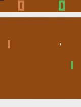
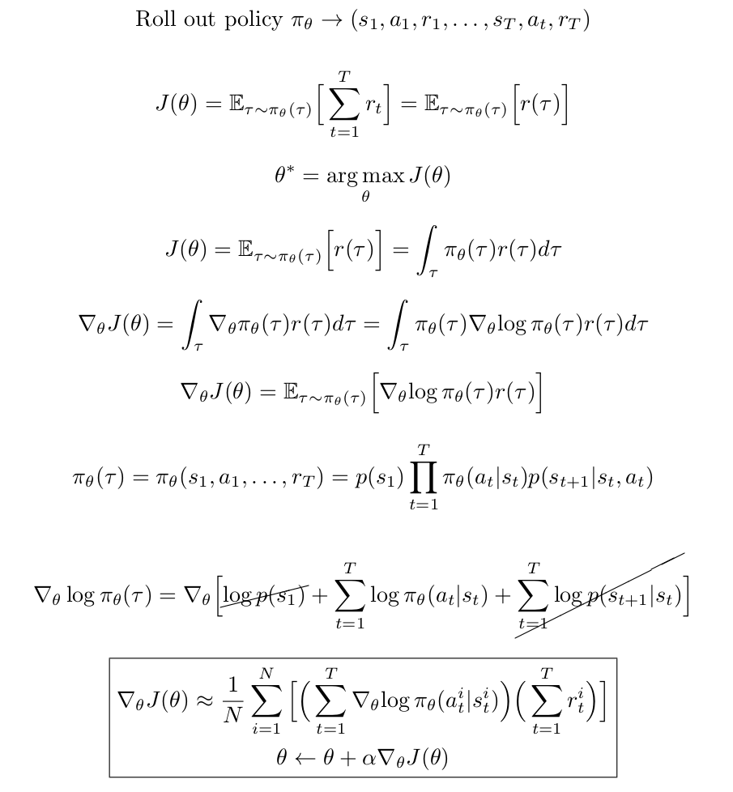

Learning to play Pong using PPO in PyTorch
==========================================
*May 23, 2019*

The rules of Atari Pong are simple enough. You get a point if you put the ball past your opponent, and
your opponent gets a point if the ball goes past you. How do we train a neural network to look at the pixels
on the screen and decide whether to go up or down?



Unlike supervised learning, no labels are available. So, we turn to reinforcement learning.
Policy gradients are one way to update the weights of the network
to maximize the reward. The idea is to start with random initialization, i.e., the network predicts about 50% probability
for both up and down regardless of the observation and to roll out the policy (play the game).
At each time step, the network looks at the frame and predicts the probability of going up and down.
We sample from this distribution and take the sampled action. At the end of the episode, the weights of
the network are updated to increase the probability of taking a certain action if that action led to a positive reward
and decrease the probability of taking an action if it led to a negative reward. This is how plain policy gradient works.
It is similar to supervised learning, but with each sample in the cross entropy loss function weighted by the reward for that episode (the
labels are the actions that were sampled during the policy roll out). Here's the math:



Policy gradients as described above suffers from the problem that the weight update after a policy roll out might
change the probability of taking a certain action by a large amount. This is undesirable because the gradients are noisy
and making large changes to the network after every policy roll out causes convergence problems. Why not reduce the step size?
This can work but if the step size is reduced too much, then learning will be hopelessly slow. So, plain policy gradients are
sensitive to the step size. One solution to this problem is to limit (constrain) the KL divergence between the probability of actions
before and after the weight update. That's what [Trust Region Policy Optimization (TRPO)](https://arxiv.org/pdf/1502.05477) does, but it needs conjugate gradients. [Proximal Policy Optimization (PPO)](https://arxiv.org/abs/1707.06347) is a simplification that adds a penalty to the loss function to penalize large probability changes. This has an effect similar to TRPO and works well in practice.


Here is code implementing PPO in PyTorch (also in this [Gist](https://gist.github.com/s-gv/b13974f896c7baf81ea3a83cf1af4a66)).

```
import random
import gym
import numpy as np
from PIL import Image
import torch
from torch.nn import functional as F
from torch import nn

class Policy(nn.Module):
    def __init__(self):
        super(Policy, self).__init__()

        self.gamma = 0.99
        self.eps_clip = 0.1

        self.layers = nn.Sequential(
            nn.Linear(6000, 512), nn.ReLU(),
            nn.Linear(512, 2),
        )
    
    def state_to_tensor(self, I):
        """ prepro 210x160x3 uint8 frame into 6000 (75x80) 1D float vector. See Karpathy's post: http://karpathy.github.io/2016/05/31/rl/ """
        if I is None:
            return torch.zeros(1, 6000)
        I = I[35:185] # crop - remove 35px from start & 25px from end of image in x, to reduce redundant parts of image (i.e. after ball passes paddle)
        I = I[::2,::2,0] # downsample by factor of 2.
        I[I == 144] = 0 # erase background (background type 1)
        I[I == 109] = 0 # erase background (background type 2)
        I[I != 0] = 1 # everything else (paddles, ball) just set to 1. this makes the image grayscale effectively
        return torch.from_numpy(I.astype(np.float32).ravel()).unsqueeze(0)

    def pre_process(self, x, prev_x):
        return self.state_to_tensor(x) - self.state_to_tensor(prev_x)

    def convert_action(self, action):
        return action + 2

    def forward(self, d_obs, action=None, action_prob=None, advantage=None, deterministic=False):
        if action is None:
            with torch.no_grad():
                logits = self.layers(d_obs)
                if deterministic:
                    action = int(torch.argmax(logits[0]).detach().cpu().numpy())
                    action_prob = 1.0
                else:
                    c = torch.distributions.Categorical(logits=logits)
                    action = int(c.sample().cpu().numpy()[0])
                    action_prob = float(c.probs[0, action].detach().cpu().numpy())
                return action, action_prob
        '''
        # policy gradient (REINFORCE)
        logits = self.layers(d_obs)
        loss = F.cross_entropy(logits, action, reduction='none') * advantage
        return loss.mean()
        '''

        # PPO
        vs = np.array([[1., 0.], [0., 1.]])
        ts = torch.FloatTensor(vs[action.cpu().numpy()])
        
        logits = self.layers(d_obs)
        r = torch.sum(F.softmax(logits, dim=1) * ts, dim=1) / action_prob
        loss1 = r * advantage
        loss2 = torch.clamp(r, 1-self.eps_clip, 1+self.eps_clip) * advantage
        loss = -torch.min(loss1, loss2)
        loss = torch.mean(loss)

        return loss

env = gym.make('PongNoFrameskip-v4')
env.reset()

policy = Policy()

opt = torch.optim.Adam(policy.parameters(), lr=1e-3)

reward_sum_running_avg = None
for it in range(100000):
    d_obs_history, action_history, action_prob_history, reward_history = [], [], [], []
    for ep in range(10):
        obs, prev_obs = env.reset(), None
        for t in range(190000):
            #env.render()

            d_obs = policy.pre_process(obs, prev_obs)
            with torch.no_grad():
                action, action_prob = policy(d_obs)
            
            prev_obs = obs
            obs, reward, done, info = env.step(policy.convert_action(action))
            
            d_obs_history.append(d_obs)
            action_history.append(action)
            action_prob_history.append(action_prob)
            reward_history.append(reward)

            if done:
                reward_sum = sum(reward_history[-t:])
                reward_sum_running_avg = 0.99*reward_sum_running_avg + 0.01*reward_sum if reward_sum_running_avg else reward_sum
                print('Iteration %d, Episode %d (%d timesteps) - last_action: %d, last_action_prob: %.2f, reward_sum: %.2f, running_avg: %.2f' % (it, ep, t, action, action_prob, reward_sum, reward_sum_running_avg))
                break
    
    # compute advantage
    R = 0
    discounted_rewards = []

    for r in reward_history[::-1]:
        if r != 0: R = 0 # scored/lost a point in pong, so reset reward sum
        R = r + policy.gamma * R
        discounted_rewards.insert(0, R)

    discounted_rewards = torch.FloatTensor(discounted_rewards)
    discounted_rewards = (discounted_rewards - discounted_rewards.mean()) / discounted_rewards.std()
    
    # update policy
    for _ in range(5):
        n_batch = 24576
        idxs = random.sample(range(len(action_history)), n_batch)
        d_obs_batch = torch.cat([d_obs_history[idx] for idx in idxs], 0)
        action_batch = torch.LongTensor([action_history[idx] for idx in idxs])
        action_prob_batch = torch.FloatTensor([action_prob_history[idx] for idx in idxs])
        advantage_batch = torch.FloatTensor([discounted_rewards[idx] for idx in idxs])

        opt.zero_grad()
        loss = policy(d_obs_batch, action_batch, action_prob_batch, advantage_batch)
        loss.backward()
        opt.step()

    if it % 5 == 0:
        torch.save(policy.state_dict(), 'params.ckpt')

env.close()
```

After training for 4000 episodes, the policy network consistently beat the "computer player" with an average reward of +14.
Here is a video of the agent playing (the agent controls the green paddle to the right).


