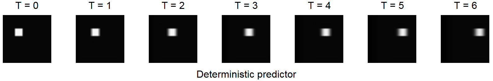
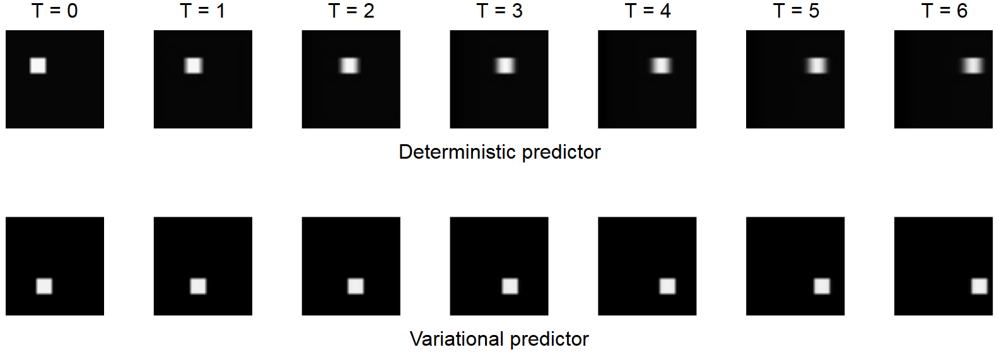

#Variational Video Prediction
*Sep 1, 2019*

Just like how your smartphone's keyboard can predict the next word
you're likely to type based on the last few words you entered, one can
predict future frames of a video by looking at the current frame.
This is really useful in [model based re-inforcement learning](https://arxiv.org/abs/1605.07157)
where you give an agent the ability to predict the future and plan a sequence of
actions based on those predictions.
It helps to dramatically cut down the number of samples needed for training.

But there is a problem. What if the dynamics of the environment has some
randomness or things you cannot easily model? When you push a pen across
the table, it might move a little faster because you applied more force than you intended to.
Sometimes the pen moves by 1 cm, sometimes 1.5 cm and so on. If a deterministic neural
network is used to model this phenomenon (you try to minimize the least squares error),
the randomness is modeled as blur. The network averages out the different possible
outcomes. This is problematic because the blur gets worse the further you predict into the future.

[Variational inference](https://arxiv.org/abs/1710.11252) can address this problem.
Suppose that the white square in the picture can move by either 2 px or 3 px in one frame.
If we're told at training time whether the pixel moved by 2 px or 3 px (via a one-hot vector),
this can be an additional input to the network. With this, the neural network can
learn to move the white square by the right number of pixels without any blur.
During inference, the one-hot vector can be chosen randomly, which would result in the white square
moving by either 2 px or 3 px. But we don't actually know by how many pixels the white square
moved during training. Another neural network to the rescue! This encoder network looks at the input and
the label and predicts the probability of choosing either of the one-hot vectors as input to the video predictor.
The [gumbel-softmax reparametrization](https://arxiv.org/abs/1611.01144) can be used to sample from this
distribution during training.

The code for this network in Keras is [here](var_translate_pred.py).

