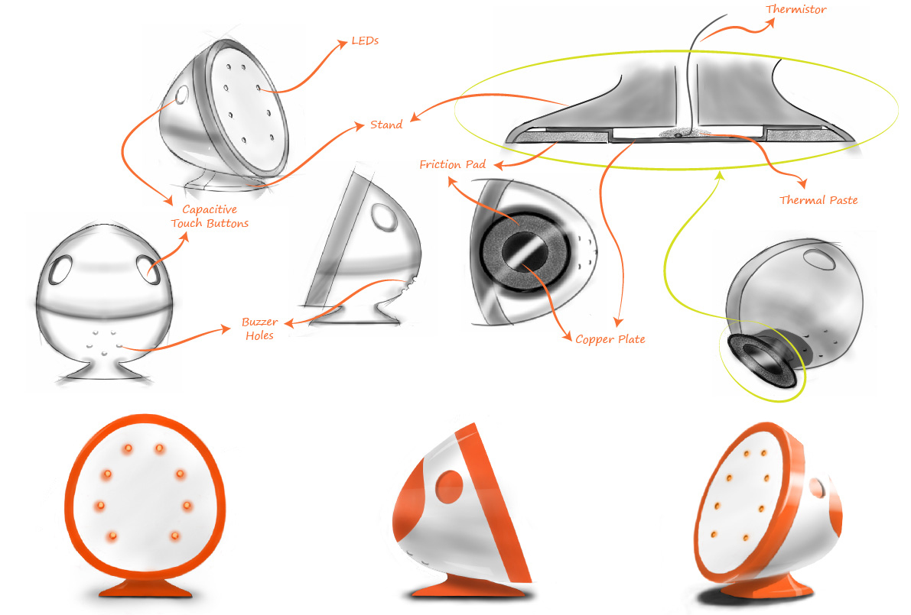
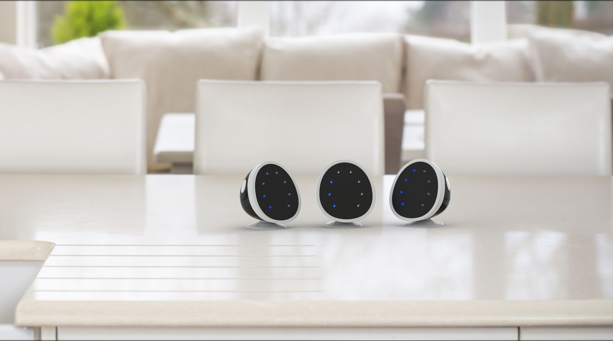

# Cookoo
*December 1, 2014*

Cookoo is a whistle counter for pressure cookers. It keeps track of your
pressure cooker so you don't have to. Keep it on your cooker and forget
about it. Cookoo will tell you when to turn off the stove. The schematic and
source code are [here](https://github.com/s-gv/cookoo).

## How does it work?

Cookoo monitors the temperature of your cooker. When the cooker whistles, the
pressure inside it falls rapidly. This causes a sharp decrease in temperature,
which Cookoo detects. Cookoo alerts you when the cooker has whistled the number
of times you had set.

## Why Cookoo?

This hobby project came out of our own need as terrible cooks. We suffered from
the problem of having our food burnt in pressure cookers on a regular basis.
Talking to other rookie cooks made us realize that this is a common problem, so
we tried to solve it by building Cookoo.

## Does it help?
We built a few prototypes and handed them out. It not only helped inexperienced
cooks circumvent their kitchen woes, but also helped save the efforts of many
experienced cooks who toil in the kitchen daily. Women in Indian kitchens are
engaged in several other activities while cooking. Cookoo reduced the cognitive
load of such users, thereby making cooking much more relaxing. Also, from a
safety perspective, the device could help avoid accidents that occur due to
pressure cooker explosions.

## Authors

Sagar Gubbi ([me@sagargv.com](mailto:me@sagargv.com)) and
Dhruv Saxena ([dhruv.writeme@gmail.com](mailto:dhruv.writeme@gmail.com)).
